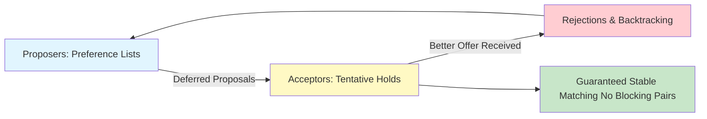

# GenPark Gale-Shapley Deferred Acceptance Matching Skill

Gale-Shapley deferred acceptance algorithm ensuring stable, envy-free, and Pareto-efficient bipartite matching.

Learn more at [GenPark](https://genpark.ai) and the [GenPark MCP Catalog](https://genpark.ai/mcp).

## Features
- Classic Gale-Shapley proposing-oriented deferred acceptance algorithm.
- Guaranteed stability with zero blocking pairs.
- Pure Python standard library.
