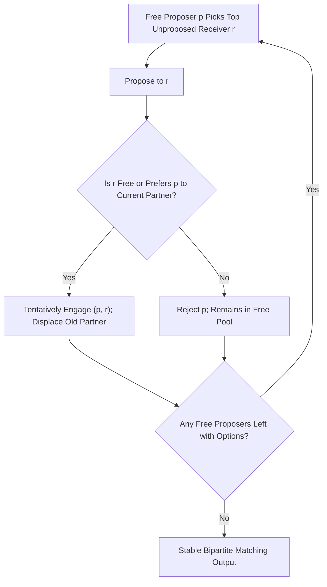

# Gale-Shapley Stable Matching Skill

Nobel Memorial Prize-winning Deferred Acceptance algorithm providing strategy-proof, blocking-pair-free stable matchings.

```mermaid
flowchart TD
    Free["Free Proposer p Picks Top Unproposed Receiver r"] --> Propose["Propose to r"]
    Propose --> Check{"Is r Free or Prefers p to Current Partner?"}
    Check -- Yes --> Engage["Tentatively Engage (p, r); Displace Old Partner"]
    Check -- No --> Reject["Reject p; Remains in Free Pool"]
    Engage --> More{"Any Free Proposers Left with Options?"}
    Reject --> More
    More -- Yes --> Free
    More -- No --> Stable["Stable Bipartite Matching Output"]
```

## Features
- **100% Python Standard Library**: Linear-time preference list traversal.
- **Guaranteed Stability**: Eliminates all blocking pairs where agents prefer each other.
- **Proposer-Optimality**: Yields best achievable stable match for proposing agents.
